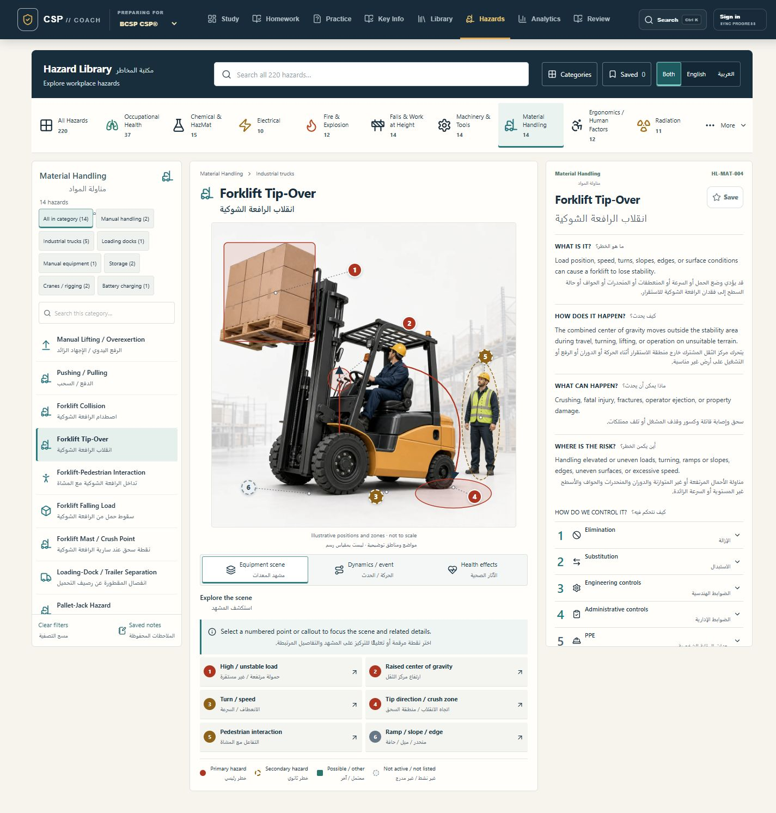
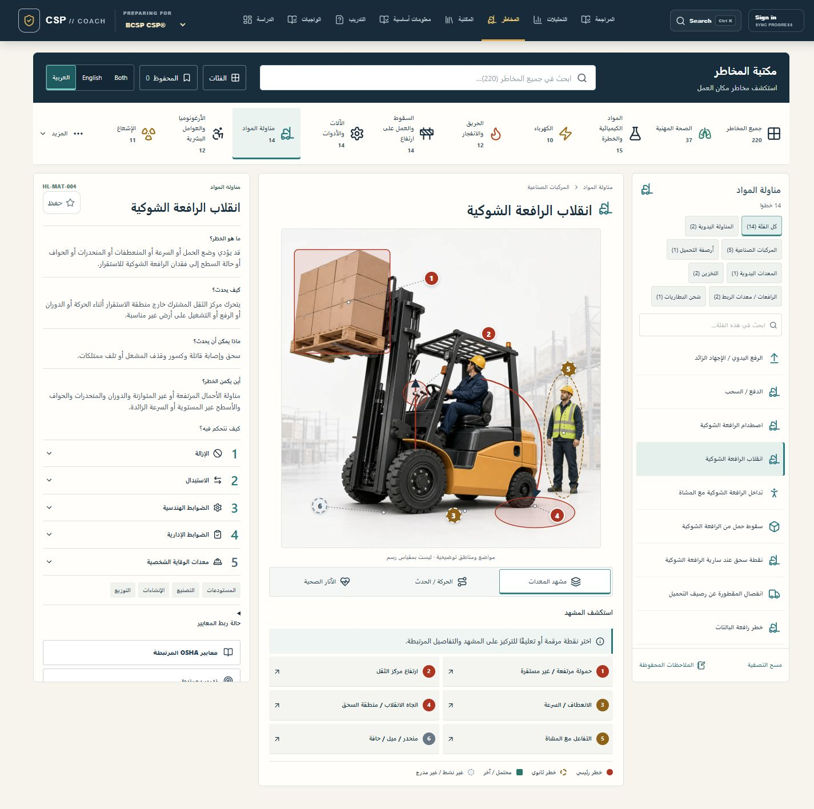
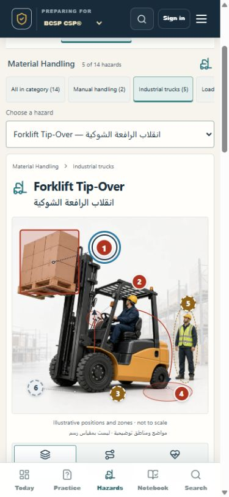

# Phase 10 screenshot index

Captured from the local production preview on 2026-08-31. The first ten screenshots satisfy the requested visual QA set. Full-page captures include the document content; fixed navigation and independently scrollable panels retain their viewport behavior in the capture.

| # | Screenshot | Viewport | Coverage |
| --- | --- | --- | --- |
| 1 | [Category overview](01-category-overview.png) | 1440 × 1000 | 18 categories, 220 canonical hazards |
| 2 | [Forklift Tip-Over](02-forklift-desktop.png) | 1440 × 1000 | Equipment engine, three-column workspace |
| 3 | [Arc Flash / Arc Blast](03-arc-flash-desktop.png) | 1440 × 1000 | Worker engine, electrical icon |
| 4 | [Oxygen-Deficient Atmosphere](04-confined-space-desktop.png) | 1440 × 1000 | Process engine, confined space |
| 5 | [Unexpected Startup / Energization](05-loto-desktop.png) | 1440 × 1000 | Process engine, LOTO |
| 6 | [Alpha Radiation](06-radiation-desktop.png) | 1440 × 1000 | Concept engine |
| 7 | [Asbestos](07-occupational-health-desktop.png) | 1440 × 1000 | Occupational Health body-system engine |
| 8 | [Arabic desktop](08-arabic-desktop.png) | 1440 × 1000 | RTL text/layout, unmirrored physical scene |
| 9 | [Mobile full page](09-mobile.png) | 390 × 844 | Stacked selector, scene, controls, actions and source |
| 10 | [Tablet full page](10-tablet.png) | 1024 × 1000 | Explorer beside scene; Details below |
| 11 | [Wide desktop](11-wide-desktop.png) | 1920 × 1080 | 1680 px maximum workspace width |
| 12 | [Laptop](12-laptop.png) | 1366 × 768 | Shorter desktop viewport |
| 13 | [Mobile selected marker](13-mobile-marker.png) | 390 × 844 | Full scene and selected 44 px marker |

## Desktop

## Arabic

## Mobile scene interaction

See the [complete 41-point Phase 10 report](../hazard-library-phase-10.md) for implementation details, regression checks, baseline failures and limitations.
